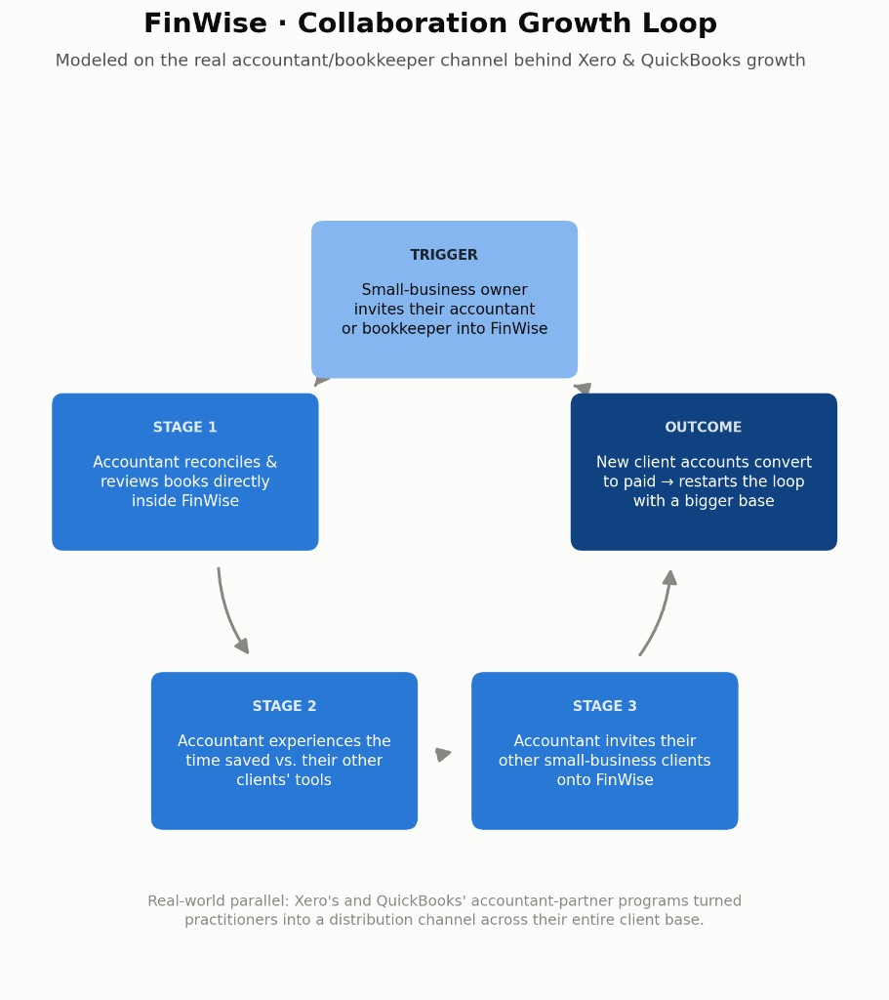

# FinWise · Hypothesis & Bet, Module 1

## First hypothesis

- **Hypothesis:** I think FinWise's biggest problem is that the product doesn't give users enough reason to stick around — and that shows up twice: only 2% of trial users ever convert to paying, and even among those who do convert, 60% churn within a year.
- **Evidence:** The reverse trial rules out "they never saw the value." FinWise's reverse trial gives users full access to premium features before deciding to pay — unlike a capped free trial, the 2% conversion rate can't be blamed on people never experiencing what they'd be paying for. They saw the whole product, and 98% still walked away.

The people who do convert don't stick either. 40% one-year retention (60% churn) shows the same underlying problem — not enough reason to stay — showing up again on the other side of the funnel, among people who already decided FinWise was worth paying for.

The growth engine doesn't actually look product-led anymore. Most of the budget goes to paid acquisition to drive trial sign-ups, and that spend has stopped producing meaningful growth. A real PLG motion is supposed to reduce reliance on paid acquisition over time as the product itself creates loops that bring in new users — FinWise leaning harder on ad spend to fill a leaky funnel was always going to hit a ceiling once the leak outpaced the tap.

- **Bet:** Test guided onboarding that drives deeper engagement with core value during the trial, measured by trial-to-paid conversion with 1-year retention as a guardrail.

## Testable hypothesis

- **IF** FinWise adds guided onboarding during the reverse trial that actively directs new users to complete the product's core actions — connecting their financial data and generating their first report — within their first session or two
- **THEN** trial-to-paid conversion will increase from ~2% to 3–4% within one quarter
- **BECAUSE** users who actually experience the product's core value during the trial are the ones who will feel genuine loss when the reverse-trial downgrade hits, and are also more likely to stay engaged — and therefore retained — after converting
- **MEASURED WITH** an A/B test on new trial sign-ups over one full quarter, trial-to-paid conversion rate as the primary metric, and 1-year retention of newly converted customers as a guardrail metric

## Hands-On Lab · Pressure-test

- **Most surprising pattern:**
The pattern Ithat suprised me is the flat Trial→Paid rate (1.87%–2.08% every single month for 13 months straight). It's surprising because you'd expect a conversion rate to move around at least a little as traffic volume and quality shift month to month — instead it barely budges, no matter what else is happening. That kind of stubborn consistency across 13 months is what tipped me off that this isn't a traffic issue, it's something structural in the trial experience itself
- **Biggest drop-off stage:** Activation
- **Verdict:** Confirmed
- **What the data told me:**
The trial-to-paid conversion rate stayed
essentially flat at ~2% across all 13 months, regardless of how much Visits or Trials swung month to month (Visits ranged 5,130–9,426, Trials ranged 321–644, but Trial→Paid never left the 1.87%–2.08% band). That told me the constraint isn't top-of-funnel traffic — it's something happening during the trial that isn't converting people into value, which is exactly what my Exercise 1 hypothesis pointed at before I saw any data.

## My bet

- **Growth loop:** Collaboration

- **Reasoning:** Financial-management software for a small business is rarely used by just one person — an owner's accountant or bookkeeper is often already reviewing the books — so inviting that second, professional user in is a natural, high-context action, not a generic referral ask. It also mirrors a real, documented pattern: Xero and QuickBooks both drove major growth through accountant-partner channels, where one practitioner brings in their whole client book.
- **Formalized:** FinWise's biggest growth problem is Trial users aren't reaching real activation before the reverse-trial downgrade hits. because The trial-to-paid conversion rate stayed flat at roughly 2% for 13 straight months regardless of how much traffic or how many trials FinWise generated — showing the issue isn't acquisition volume, but something happening during the trial itself., and the highest-leverage experiment I'd run first is Redesigning trial onboarding to drive users to complete FinWise's core actions (connecting their data, generating a report) within their first session, measured by trial-to-paid conversion with 1-year retention as a guardrail..

