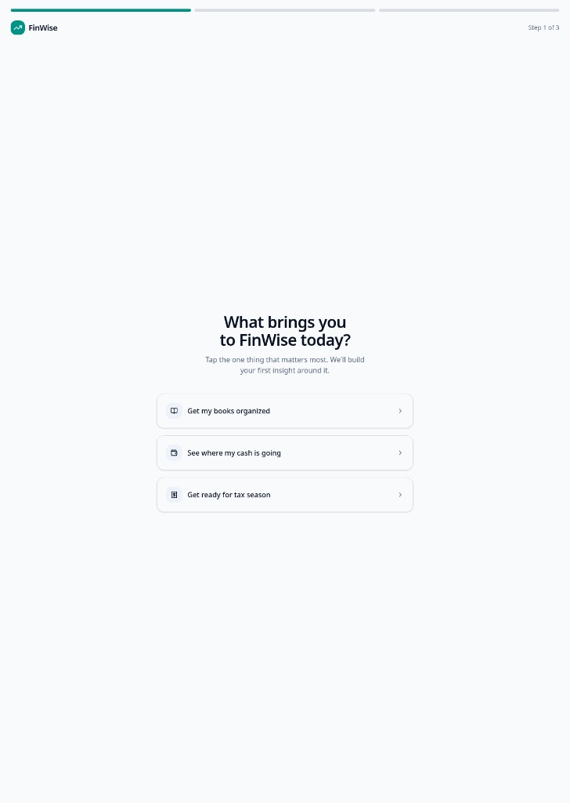
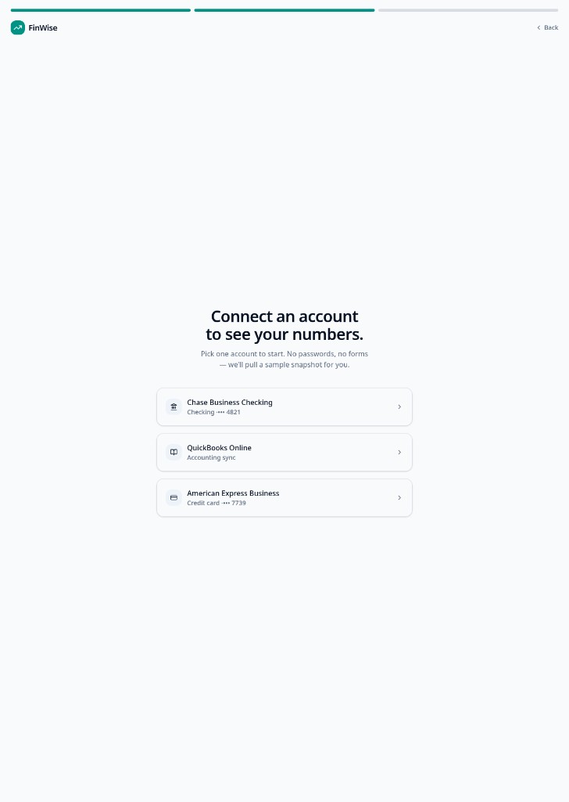
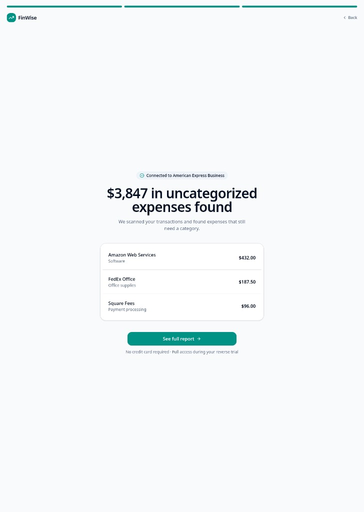

# The Solution · FinWise

The onboarding solution and the Aha moment that makes value land.

## Aha moment

The moment a new trial user connects their financial data and sees their first auto-generated report or financial snapshot — the specific realization "I didn't have to build this myself, and now I can actually see my business's numbers clearly." This builds directly on the growth bet, where "connecting data and generating a report" is named as FinWise's core value-delivering action. It beats a pure "insights/alerts" moment (like flagging a future cash shortfall) because that needs enough historical data to be meaningful — more of a Habit-stage moment than a Day-1 Aha for a brand-new trial user.

---

## Onboarding prototype

[https://lovable.dev/preview/VyxEvnoJLM8R1iphlhMWPeGAawA0Ac8C](https://lovable.dev/preview/VyxEvnoJLM8R1iphlhMWPeGAawA0Ac8C)

### Step 1 · Goal

### Step 2 · Connect an account

### Step 3 · First insight (Aha)

---

## Why this activates

**What changes**: Before this flow, a brand-new trial user hits FinWise as an empty, unproven tool — they'd have to manually connect their real data and dig around before seeing any personal payoff, and that gap is exactly where the 98% who never convert give up. After the flow, within under a minute of signing up, the user sees one concrete, specific number pulled from their own actual data — "$4,200 in unbilled invoices found" — not a demo, not sample screenshots of what the product *could* show them, but proof already computed. The user's status shifts from "evaluating unproven software" to "I already found money I'd have missed without this."

**Why it converts trial users**: this is the reverse-trial mechanic working as designed — the entire premise of a reverse trial is exposing full value immediately rather than gating it behind a paywall, so the model only pays off if the very first interaction delivers something real. By collapsing "sign up → see a generic empty dashboard → maybe explore → maybe eventually notice value" down to "sign up → connect one account → see your own money," the flow front-loads the realization moment into the window before a user has decided whether this is worth their time at all. That's the specific lever the funnel data pointed to: with only 2% converting, the problem was never demand for financial tools, it was that too few users ever reached a moment concrete enough to justify sticking around. The friction removed — manual data entry and an empty first-run state — was the thing standing between signup and that realization, and cutting it is what turns "trial" into "already seeing value."

---
