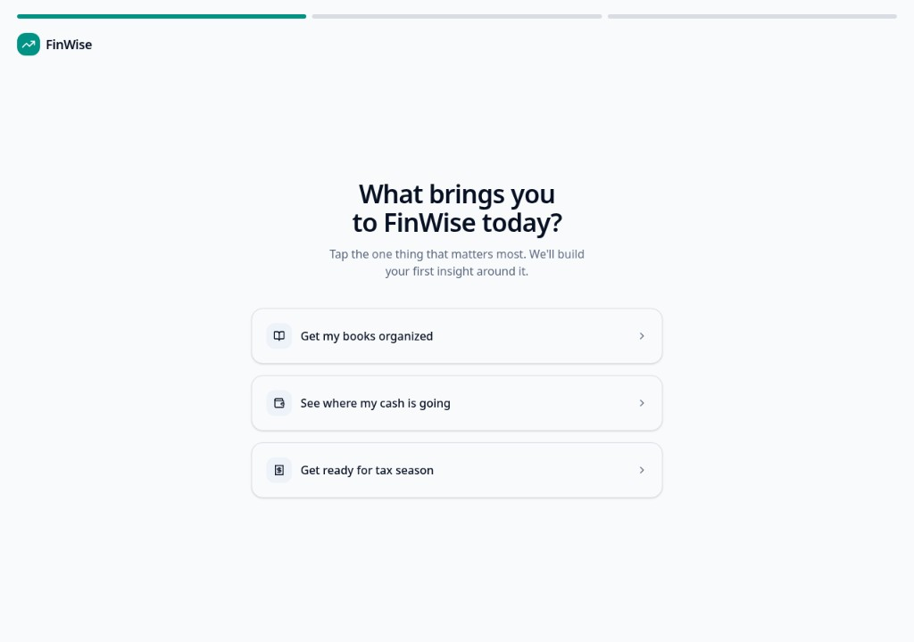
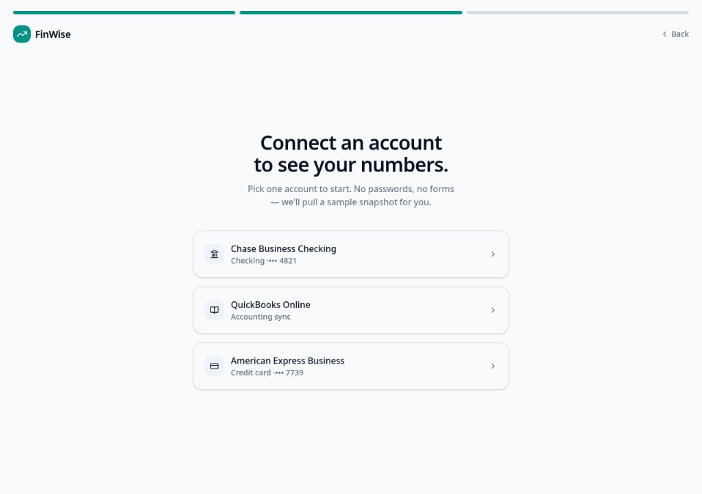
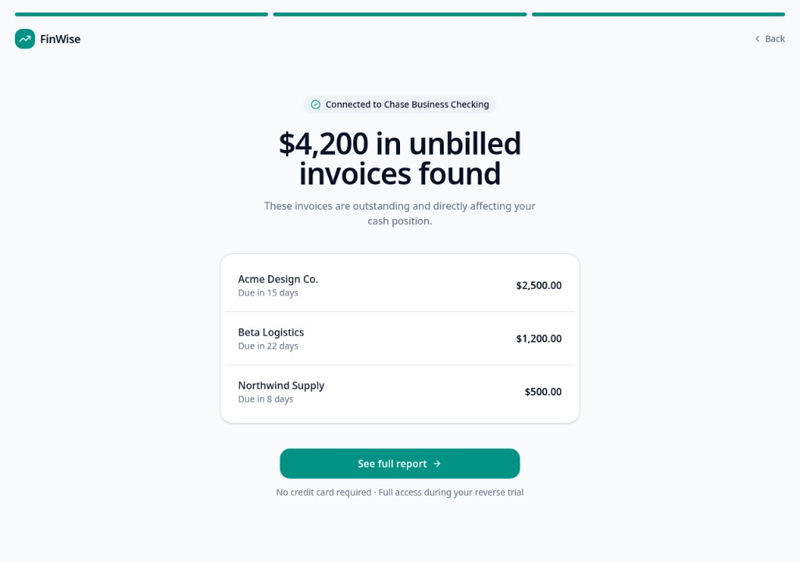
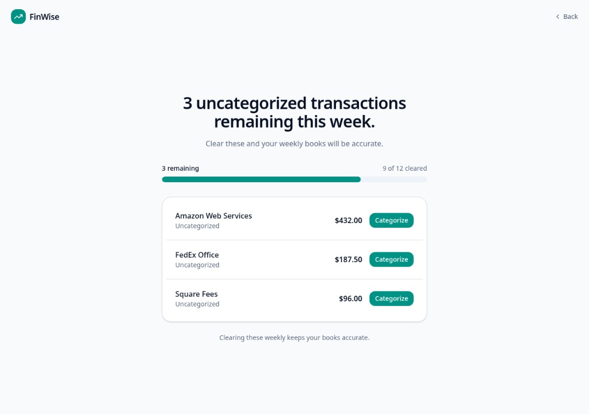

# The Mechanic · FinWise

The engagement mechanic that builds the habit loop, with rationale and a wireframe.

## The mechanic

The habit loop: trigger → action → reward → investment.

**Trigger:** External — a weekly in-app prompt on the FinWise dashboard: "3 uncategorized transactions remaining this week." Over time, this shifts toward an internal trigger — the discomfort of knowing your books are slightly out of date.

**Action:** The user opens the Weekly Review screen and categorizes the handful of remaining transactions — a low-effort, few-taps action.

**Reward:** A visible countdown ticking toward zero (satisfying completion, goal-gradient effect), plus a variable element — each week's cleanup sometimes surfaces something worth noticing (an odd charge, a pattern in spend), echoing the same kind of concrete discovery that hooked the user in onboarding.

**Investment:** Every categorized transaction makes FinWise's records for that specific business more accurate and complete, which makes next week's reports better and makes leaving FinWise more costly — the user's financial history now lives there, cleaned up, not in a spreadsheet.

## Rationale

FinWise's 60% one-year churn is value churn: users get their one Aha moment during onboarding, then usage tapers off before it ever becomes a habit. This mechanic is designed to build that habit inside the reverse trial itself — before there's a paywall or renewal decision to react to — so that by the time a user is evaluating whether to keep paying, weekly categorization is already a habit they've built, not a feature they'd have to be sold on. It's tied directly to real value (accurate books), not an arbitrary point system, which keeps it out of the "reward loop without value" trap.

## Wireframe

[https://lovable.dev/preview/DHRLZmdzWTIuB3FNCu2hmkAutmQ8yhE2](https://lovable.dev/preview/DHRLZmdzWTIuB3FNCu2hmkAutmQ8yhE2)

### Goal select

### Connect an account

### Insight · Unbilled invoices

### Weekly Clear-to-Zero

