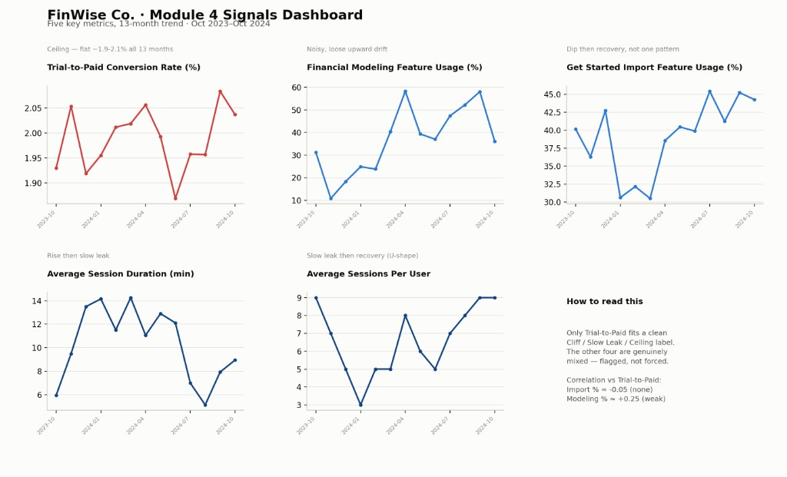

# The Signals · FinWise

Data & Analytics. The data pattern you found and the indicators you'll steer by.

## The data pattern

Trial-to-Paid Conversion Rate is a Ceiling — flat in a 1.87%–2.08% band across all 13 months, regardless of how much Visits or Trials swung month to month. The real problem behind that headline number isn't traffic, it's structural: something in the trial experience itself caps conversion at ~2% no matter what. The four underlying usage/session metrics don't cleanly explain it either — Import % and Modeling % show a dip-then-recover and a noisy-upward pattern that don't map neatly onto a flat ceiling, and correlation testing confirms it: Import % has essentially no relationship with conversion (r ≈ -0.05), Modeling % only a weak one (r ≈ +0.25). The likely explanation is an instrumentation gap — these are monthly aggregate usage rates across all active trial users, not one cohort's completion of import → modeling → conversion, so the real signal is probably being diluted by mixing overlapping cohorts.

## Leading indicators

**Get Started Import Feature Usage %** — the exact activation step the Module 2 onboarding redesign targets; directly upstream of the conversion ceiling.

**Financial Modeling Feature Usage %** — the second half of the North Star itself, and the behavior the Module 3 habit mechanic (Weekly Clear-to-Zero) is built to reinforce; the stronger, though still weak, of the two correlations with conversion.

## Lagging indicators

**Trial-to-Paid Conversion Rate** — the outcome metric that confirms whether moving the two leading indicators actually shows up in the business result at scale.
