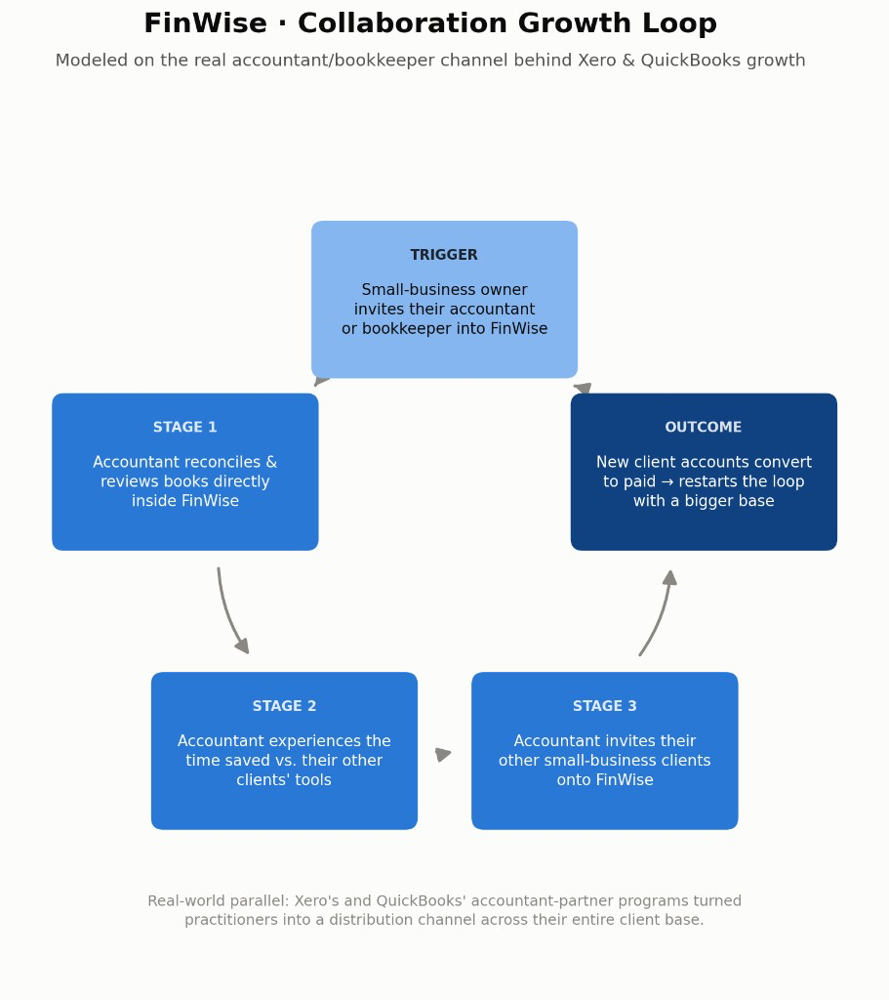
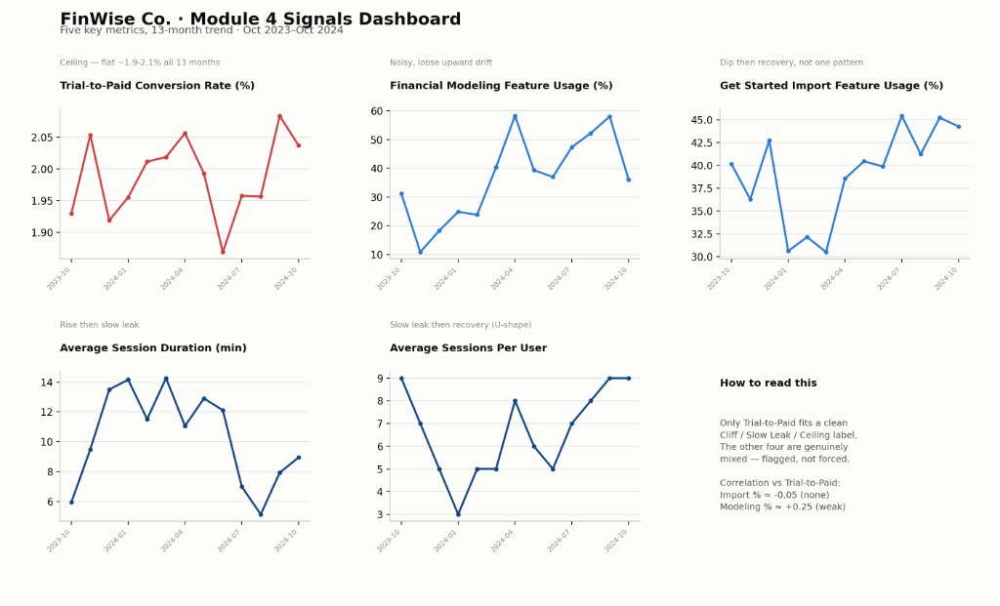

# FinWise, A Product-Led Growth Strategy

> Activate trial users on real financial data in the first session, build a weekly clear-to-zero habit before the paywall, and package free vs paid around Financial Modeling so PLG can compound instead of depending on paid acquisition.

Nandini Kodali · August 2026

Evidence-backed growth and experimentation strategy for FinWise Co. One folder per workstream; this README is the through-line that ties them together. Visual companion: [`pitch.html`](pitch.html).

---

## Workstreams at a glance

| # | Workstream | Deliverable | Folder |
|---|---|---|---|
| 1 | **The Bet** (PLG motion) | growth hypothesis & bet + collaboration growth-loop viz | [`01-bet/`](01-bet/growth-bet.md) |
| 2 | **The Solution** (Acquisition & Activation) | import-first onboarding prototype + Aha-moment definition | [`02-solution/`](02-solution/activation-solution.md) |
| 3 | **The Mechanic** (Retention & Engagement) | Weekly Clear-to-Zero + rationale & wireframes | [`03-mechanic/`](03-mechanic/engagement-mechanic.md) |
| 4 | **The Signals** (Data & Analytics) | conversion-ceiling pattern + leading & lagging indicators | [`04-signals/`](04-signals/data-signals.md) |
| 5 | **The Validation** (Experimentation) | Import-First Onboarding A/B brief + Data Studio | [`05-validation/`](05-validation/experiment-brief.md) |
| 6 | **The Model** (Pricing & Monetization) | reverse-trial + freemium packaging recommendation | [`06-model/`](06-model/pricing-model.md) |

**Presentation:** [`pitch.html`](pitch.html) · **Experiment report:** [Data Studio](https://datastudio.google.com/reporting/b2944a82-ee57-47f7-b838-fa9599111d8a)

---

## The Story

**Growth thesis:** FinWise's ~2% trial-to-paid ceiling is an activation and habit problem, not a traffic problem — so the strategy is import-first onboarding to land the Aha, Weekly Clear-to-Zero to build retention inside the reverse trial, and a freemium packaging line that keeps non-converters in the habit loop until Financial Modeling is worth paying for.

### Through-line

1. **Constraint.** Trial→Paid stayed flat between **1.87% and 2.08% for 13 months** while Visits (5,130–9,426) and Trials (321–644) swung hard. Biggest drop-off: **Activation**. Verdict: confirmed — not a top-of-funnel problem.
2. **Bet.** Redesign trial onboarding so users complete core actions — connect financial data and generate a first finding — before the reverse-trial downgrade. Longer-horizon PLG loop: **Collaboration** (owner → accountant → more client accounts), modeled on Xero / QuickBooks partner channels.



3. **Aha.** Connect one account → see a personalized finding from *your* data (e.g. uncategorized expenses / unbilled invoices). Status shift: from “evaluating empty software” to “I already found money I’d have missed.”
4. **Habit.** **Weekly Clear-to-Zero** — same language as the Aha (“X uncategorized transactions remaining this week”). Trigger → categorize → countdown reward → investment in cleaned books. Built against **value churn** (session duration and modeling usage drop after setup).
5. **Steer.** Leading: **Import Feature Usage %**, **Financial Modeling Feature Usage %**. Lagging / guardrail: **Trial-to-Paid**. Test: **Import-First Onboarding** A/B — +15% relative Import % in 14 days; Trial-to-Paid must not fall below ~1.87%; read date locked at **Day 14**.



6. **Package.** Stage 2 Revenue Expansion. Keep reconciliation / categorization free; put **Financial Modeling** behind the paywall. Stop losing the 98% at a hard cutoff — let habit continue until modeling is worth paying for.

### One friction

Trial-to-Paid barely budged for 13 months no matter what else moved. Aggregate usage metrics also barely correlated with conversion (Import % ≈ −0.05; Modeling % ≈ +0.25), so forcing a clean cliff/leak story would have been inventing signal. The honest read was: structural trial problem + instrumentation gap (monthly aggregates across overlapping cohorts, not a true import → modeling → convert cohort funnel).

### One Aha

Onboarding’s Aha (“connect data → see my own numbers”) and Weekly Clear-to-Zero are the **same job on different cadences**: keep users in contact with real financial value, not demos or points. Once that clicked, packaging followed — free forever for the habit layer, paid for Financial Modeling.

### Takeaways

- A flat conversion ceiling across traffic swings is evidence of a **structural trial problem**, not a demand problem.
- Leading indicators only steer if instrumentation matches the **cohort journey** you claim to measure.
- Experimentation works as a **system**: bet → solution → mechanic → signals → validation → model must stay on one line (Import %, then Modeling %, with a hard Trial-to-Paid guardrail and a decided read date) or the strategy falls apart.
- What I’d change next: instrument a true cohort funnel before leaning on aggregate usage %, and calculate a formal MDE instead of an assumed 15% relative lift.

---

## Repo structure

```
product-analytics-and-experimentation/
├── README.md                          ← strategy overview + through-line
├── pitch.html                         ← presentation page
├── 01-bet/                            ← hypothesis, bet, growth loop
├── 02-solution/                       ← Aha moment + onboarding prototype screens
├── 03-mechanic/                       ← Weekly Clear-to-Zero + wireframes + pre-work
├── 04-signals/                        ← data pattern + signals dashboard
├── 05-validation/                     ← experiment brief + Data Studio link
└── 06-model/                          ← pricing & packaging memo
```
